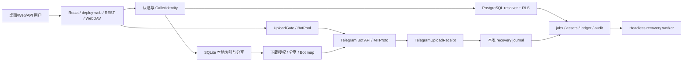
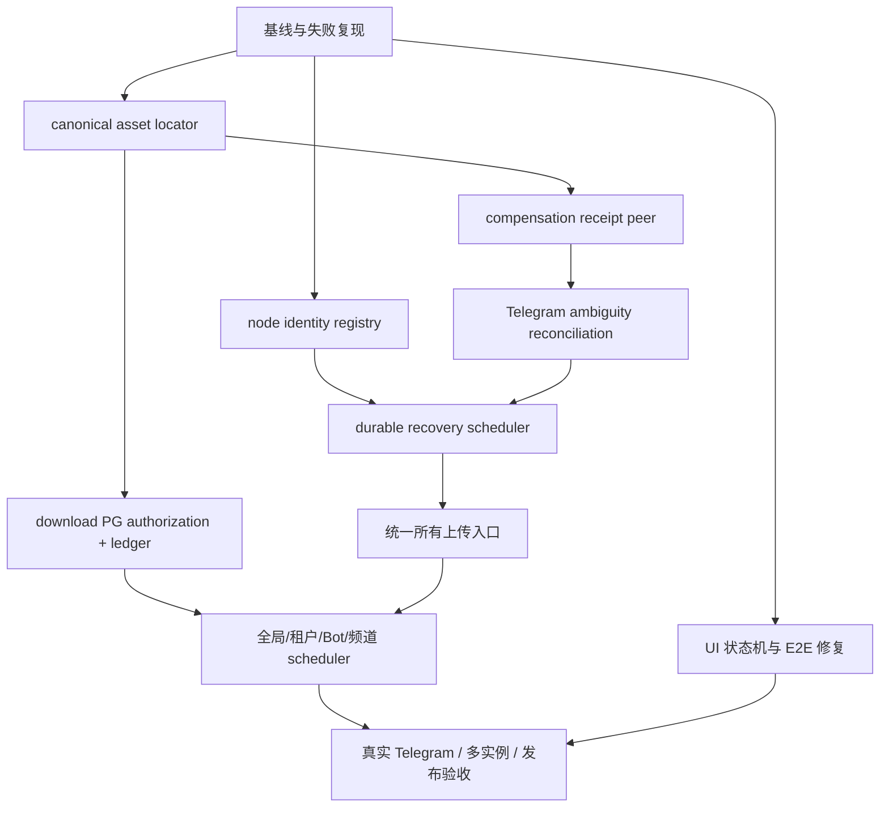

# Telegram Drive 下一步改进指南

> 项目：Telegram Drive
> 文档类型：研究、审查与实施规划
> 分析日期：2026-07-22（持续更新）
> 当前分支：`feature/optimize-floodwait-storage`
> 当前版本：应用/Cargo/Tauri 为 `4.0.0-beta`；OpenAPI 文档仍为 `3.0.0-beta`
> 文档状态：已基于当前工作区代码、配置、测试和只读验证更新；实施批次已按主题提交，真实基础设施验收仍未闭合
> 证据标签：`已验证`、`静态确认`、`合理推断`、`待验证`

> **2026-07-22 状态增补：** 当前交付线已收敛为 Web 控制台 + Rust Headless API；Tauri 桌面壳仅保留兼容代码，不属于本次 Release 承诺。已完成并提交 Web UI、PostgreSQL/Saga、Rust API、React 行为测试、E2E、CI/Compose/环境和文档批次。新鲜验证为：Rust headless 库 **201 passed / 4 ignored**、前端 **32 files / 304 tests passed**、Vite 构建通过、隔离 Web Playwright **57 passed / 2 skipped**。真实 PostgreSQL、Redis 多副本、Telegram 账号路径、Docker/Actions 和发布流程仍标记为 `待验证`；本增补优先于下文 2026-07-20 的历史基线数字。

---

## 1. 文档信息

### 1.1 仓库与分析范围

- 当前工作区不是干净发布快照：审查开始时存在大量已修改和未跟踪文件，覆盖 Rust、React、静态 Web、CI、Docker、PostgreSQL migration、运行数据和审计文档。
- 本文以**当前工作区文件**为事实来源，不把 Git HEAD、2026-06-01 的旧指南或历史审计记录当作当前事实。
- 原始指南编写阶段只更新本文件；其后经授权的实施批次已另外修改业务代码、测试、配置和发布文档，本文件中的历史基线数字须以上方 2026-07-22 增补及“已执行的检查与验证”中的新鲜证据为准。

### 1.2 已分析范围

- Tauri 桌面入口、桌面 REST/stream server、Headless Actix server。
- React 认证、文件工作台、上传、下载、分享、设置和可访问性。
- `deploy/web/` 静态管理台及其 Playwright smoke。
- Telegram Bot/User transport、Bot pool、上传门控、下载和补偿删除。
- SQLite 资产索引、租户身份、分享和本地运行数据。
- PostgreSQL SaaS control plane、RLS、tenant resolver、上传 Saga、recovery worker、migration 000–009。
- CI/CD、构建、测试、Docker、环境变量、备份与恢复说明。

### 1.3 未分析或未真实验证范围

- 未使用真实 Telegram Bot/User 账号执行上传、下载、删除、分享访问和登录。
- 未对真实 PostgreSQL 执行查询、migration、写入或回滚。
- 未启动 Tauri 桌面窗口，未做 NVDA、高对比度、200% 缩放和真实移动设备验收。
- 未运行 Docker、真实多副本、Redis、Webhook、备份恢复或生产发布流程。
- 未计算新的 Rust/前端覆盖率百分比。
- 未做真实负载、长时间运行、内存泄漏、磁盘耗尽和网络故障注入。

### 1.4 证据来源

- 当前源代码、配置、SQL migration、测试和 CI 文件。
- `git status --short`、`git diff --check` 和符号/调用搜索。
- 本轮实际执行的 Rust 格式/编译、React 测试/构建、静态 JS 语法检查和 Playwright 静态 Web smoke。
- 同日已有 PostgreSQL/RLS/Saga 验证记录只作为**历史证据**引用，本轮未重跑数据库写入测试。

---

## 2. 执行摘要

### 2.1 当前阶段

Telegram Drive 已从单机桌面工具演进为“桌面端 + Headless API + 静态 Web 控制台 + Telegram 双传输 + SQLite 本地索引 + PostgreSQL SaaS control plane 原型”的复合产品。当前代码已经具备上传 Saga 的关键结构，不再是旧指南描述的“尚未接 PostgreSQL”。但系统事实源仍分裂，只有 Headless REST 上传路径进入 PostgreSQL Saga，下载授权、分享、桌面上传、WebDAV、旧分片路径和 SaaS 计量没有形成统一闭环。

### 2.2 最值得保留的资产

1. 强制 RLS、tenant-scoped transaction 和受限 PostgreSQL runtime role。
2. 上传业务幂等键、请求指纹、fence token、lease、receipt、原子 finalize。
3. append-only recovery journal、intent-before-delete 补偿顺序和 `SKIP LOCKED` claim。
4. Bot/User 双传输、Bot pool、FloodWait/节流、上传门控和 maintenance 基础。
5. React 上传/下载队列、取消/重试、服务能力门禁、移动底栏、确认对话框焦点管理。
6. CI 已有 format、clippy、test、coverage、audit、Docker smoke、Playwright 和发布质量依赖骨架。

### 2.3 最重要的问题

| 顺序 | 问题 | 等级 | 结论 |
|---:|---|---|---|
| 1 | 下载资产只以 Telegram `message_id` 定位，授权未绑定 peer/folder | P0 / L3 | `message_id` 是 peer scoped；当前授权键与下载键不一致 |
| 2 | Bot compensation 删除使用当前配置频道，不使用 receipt 的真实 peer | P0 / L3 | 配置切换或节点漂移时可能删除错误频道中相同 ID |
| 3 | 共享 `POSTGRES_APP_USER` 同时充当 recovery node identity | P0（多实例）/ L3 | 009 只绑定数据库角色，无法证明是持有 staged source/journal 的实例 |
| 4 | Telegram 已接受但响应丢失的歧义窗口没有对账策略 | P0 / L3 | 无 receipt 时重试可能产生重复消息 |
| 5 | 上传/下载/分享/桌面/WebDAV/旧接口没有统一 control plane | P1 / L3 | 只有 `/api/v1/files` 使用 PostgreSQL Saga |
| 6 | recovery 不是 durable scheduler | P1 / L2 | 不处理 pending/expired running，缺 backoff、上限、dead-letter |
| 7 | 文件页状态和会话恢复会误导用户 | P1 / L2 | 服务未就绪可显示空目录；临时错误可能触发重新认证 |
| 8 | 静态 Web E2E 曾有失败，已完成复验 | P1 / L2 | 新鲜隔离运行 57 通过、2 跳过；跳过原因是静态服务没有 health API |
| 9 | API/版本/文档和上游来源仍有差异 | P1 / L2 | 当前 Web/Headless 发布线已收敛，但 Tauri updater、未合并上游提交和 OpenAPI 版本仍需单独审计 |

### 2.4 推荐总体顺序

资产 locator 与下载越权边界 → Bot compensation peer → DB role/node identity → Telegram 歧义对账 → recovery scheduler → 下载 PostgreSQL 授权/计量 → 入口收敛 → UI 状态和 E2E → 全局/租户/Bot/频道 durable scheduler → 真实 Telegram、多实例、发布与回滚验收。

### 2.5 当前最大的交付风险

最大的风险不是某个测试未通过，而是**SQLite、PostgreSQL、Telegram peer、recovery node 和 UI 可能对同一资产给出不同事实**。在统一资产身份和状态机之前，继续增加调度、计费或多副本会扩大不一致半径。

---

## 3. 当前项目基线

### 3.1 项目目标与用户

- 个人桌面用户：把 Saved Messages 或频道作为文件存储。
- Headless 用户：通过 REST、Web 控制台、WebDAV 和本机/Docker 服务运行 7×24 网关。
- SaaS/企业方向：多租户、API key、配额、审计、用量、Bot pool、Redis 和 PostgreSQL control plane。

### 3.2 技术栈

| 层 | 当前事实 |
|---|---|
| 前端 | React 19.1、TypeScript 5.8、Vite 7、Tailwind 4、TanStack Query、Framer Motion、Vitest |
| 桌面 | Tauri v2 |
| 后端 | Rust 2021、Actix-web、Tokio、Grammers、Reqwest |
| 本地数据 | SQLite：资产索引、Bot 映射、分享、租户/API key |
| SaaS 数据 | PostgreSQL migration 000–009：RLS、资产、job、ledger、audit、Saga recovery |
| 并发/队列 | Tokio semaphore、Redis 可选 upload gate、Bot pool 内存状态 |
| 部署 | Windows 本机、Docker/Compose、GitHub Actions；当前发布线为 Web/Headless，Tauri release 暂停 |

### 3.3 主要入口

- Headless：`app/src-tauri/src/bin/telegram-drive-server.rs`。
- Headless HTTP：`app/src-tauri/src/server_http.rs`。
- Desktop REST：`app/src-tauri/src/desktop_api_server.rs`。
- Desktop streaming/share：`app/src-tauri/src/lib.rs` → `server::start_server()`。
- React：`app/src/main.tsx` → `app/src/App.tsx` → `AuthWizard`/`Dashboard`。
- Web：`deploy/web/*.html` + `deploy/web/assets/*.js`。

### 3.4 测试与 CI 基线

- 前端 `npm.cmd run test`：32 个测试文件、304 个测试通过；保留 React `act` 与 Framer Motion mock 警告。
- 前端 `npm.cmd run build`：退出码 0，Vite 2231 modules；Dashboard chunk 674.71 kB、PDF worker 2.36 MB，仍有大 chunk/Browserslist 警告。
- 隔离静态 Web Playwright：57 通过、2 跳过；2 个跳过项均因静态服务没有 `/api/v1/health`，不是失败。
- Rust `cargo fmt --manifest-path app/src-tauri/Cargo.toml -- --check`：退出码 0。
- Rust `cargo test --manifest-path app/src-tauri/Cargo.toml --no-default-features --features headless-server --lib`：201 passed、4 ignored、0 failed；编译阶段有 13 条既有 warning。
- 静态 Web JavaScript `node --check`：当前 `deploy/web/assets` 全部通过；shares 跨标签监听定向测试 2 passed。
- CI/Compose 工作流已静态解析并按 Web/Headless 发布线收敛；未在本机执行 Docker、GitHub Actions 或真实发布。

### 3.5 已知限制

- PostgreSQL adapter 只允许 loopback `NoTls`，不支持当前形态下的独立容器 hostname 或 managed PostgreSQL TLS。
- Headless 有 recovery worker；Desktop REST 没有 parity。
- 只有 REST `POST /api/v1/files` 接入 Saga；桌面命令、WebDAV、legacy chunk/merge 仍走旧逻辑。
- 下载授权和实际字节计量尚未进入 PostgreSQL control plane。
- 真实 Telegram 和真实多实例未验收。

---

## 4. 项目架构和关键链路

### 4.1 上传状态流

`POST /api/v1/files`：认证 → 读取 multipart → 临时文件与 SHA-256 → durable staging → `begin_upload` → Telegram upload → journal → PG receipt → PG 原子 finalize → SQLite/下载链接响应。

已实现状态：`pending`、`running`、`telegram_succeeded`、`finalized`、`compensation_pending`、`compensated`、`failed`。但所谓 preflight 发生在完整 body 已到达并写入本地文件之后，不是网络层或配额层早拒绝。

### 4.2 下载状态流

API 下载先用 SQLite `file_assets` 按 `message_id` 做 owner 检查，再把请求中的 `folder_id` 交给 Telegram 下载。授权 locator 与实际 Telegram locator 不同，是当前最高风险接缝。

### 4.3 权限流

HTTP API key 由 SQLite 映射到 caller；Rust 把 legacy owner key 传给 PG resolver；事务设置 `app.tenant_id`；RLS 隔离 tenant rows；runtime role 拒绝 superuser、BYPASSRLS、表 owner、角色成员关系和 `current_user != session_user`。数据库仍依赖 Rust 认证层正确传入 owner，不能独立证明 HTTP 身份。

### 4.4 错误与恢复流

Telegram 成功后 journal 先于 PG receipt/finalize，方向正确；finalize 失败先写 compensation intent 再删除 Telegram。Headless worker 每 30 秒扫描 journal 和 DB，但只处理 `telegram_succeeded`、`compensation_pending`，不处理 pending、expired running 和 accepted-but-response-lost。

---

## 5. 已执行的检查与验证

| 检查项 | 命令或操作 | 结果 | 状态 | 说明 |
|---|---|---|---|---|
| 工作区基线 | `git status --short` | 大量既有 dirty entries | 已验证 | 全部作为受保护基线 |
| Rust 格式 | `cargo fmt --all -- --check` | 退出码 0 | 已验证 | 未改写文件 |
| Headless 编译 | `cargo check --bin telegram-drive-server --features headless-server` | 退出码 0，17 warnings | 已验证 | 不等同 Clippy 全绿 |
| React 测试 | `cd app && npm.cmd run test` | 退出码 0 | 已验证 | 32 files / 304 tests；有 act/DOM 属性警告 |
| React 构建 | `cd app && npm.cmd run build` | 退出码 0 | 已验证 | 2231 modules；Dashboard 674.71 kB |
| 静态 JS | `node --check deploy/web/assets/*.js` | 退出码 0 | 已验证 | 当前 Web 资产语法通过 |
| Web E2E | 隔离静态服务器 + `tests/e2e/web-smoke.spec.ts` | 57 通过、2 跳过 | 已验证 | 跳过项是静态服务缺少 health API |
| Rust 库测试 | `cargo test --manifest-path app/src-tauri/Cargo.toml --no-default-features --features headless-server --lib` | 201 通过、4 忽略 | 已验证 | 13 条既有 warning；未运行真实 PG/Telegram |
| Rust 格式 | `cargo fmt --manifest-path app/src-tauri/Cargo.toml -- --check` | 退出码 0 | 已验证 | 未改写文件 |
| Diff | `git diff --check` | 退出码 0，CRLF 提示 | 已验证 | 无 whitespace error |
| PG/RLS/Saga | 同日历史 migrate/RLS/Saga tests | 历史记录通过 000–009、RLS、3 Saga tests | 历史证据 | 本轮未写 DB |
| 真实 Telegram | 未执行 | 无结果 | 待验证 | 不以 mock 代替 |
| Desktop UI | 未启动 | 无结果 | 待验证 | 需账号/窗口环境 |
| 覆盖率 | 未运行 | 无新百分比 | 待验证 | 不引用旧基线 |

### 5.1 历史失败项的复验结论

- `shares-core listens for cross-tab invalidation`：已修复并复验；`storage`、`td-shares-invalidate` 和 `visibilitychange` 均触发刷新，定向 Playwright 2 passed。
- `upload-core prefers progress token over pwd in query`：已在隔离静态服务器全量运行中通过；未把真实 API 鉴权当作静态测试结果。
- `dashboard upload button disabled when service not ready`：已在隔离静态服务器全量运行中通过；真实 Headless API readiness 仍需凭据环境复验。

---

## 6. 现有优势与可复用资产

1. `ConfirmContext`、`MoveToFolderModal` 的焦点管理可抽为公共 modal primitive。
2. 请求指纹、unique idempotency key、attempt token 和 fenced update 可继续作为 Saga admission 核心。
3. `TelegramUploadReceipt` 已包含 peer/file/name/size/mime，可作为统一 locator 输入。
4. recovery journal 的 sync + atomic replace 可继续作为 PG 不可用时的保险。
5. PG finalize 已把 asset、ledger、audit、job terminal state 放在同一 tenant transaction。
6. `UploadGate`、BotPool、FloodWait、per-bot rate limit 是未来 durable scheduler 的执行器资产。
7. `file_access` 已集中部分授权规则，应扩展 locator，而不是在各路由复制。
8. Web 已有 `TdWebPure`、`TdFilesPure`、`TdSharePure`、`TdDownloadPure`。
9. `docker-api.yml` 已体现发布依赖同 workflow quality gate 的正确原则。
---

## 7. 问题和机会总览

| ID | 类别 | 问题或机会 | 证据 | 用户影响 | 技术影响 | 优先级 | 风险 | 置信度 |
|---|---|---|---|---|---|---|---|---|
| TD-001 | 安全/数据 | 资产 locator 仅 `message_id` | `db.rs:269-318`、`file_access.rs:93-112`、`api_routes.rs:972-992` | 可能读取错误 peer 的文件 | 授权键与下载键不一致 | P0 | L3 | 高 |
| TD-002 | 安全/补偿 | Bot 删除忽略 receipt peer | `http_upload.rs:248-300`、`telegram_transport.rs:691-724` | 可能删错频道消息 | 历史事实被当前配置覆盖 | P0 | L3 | 高 |
| TD-003 | 并发/多实例 | DB role 与 node identity 合并 | `postgres_upload_saga.rs:536-548`、migration 009 | 多实例恢复串节点 | staged source/journal 所有权不可证明 | P0 | L3 | 高 |
| TD-004 | 一致性 | accepted-but-response-lost 无对账 | Saga 失败路径与设计边界 | 重试产生重复消息 | 幂等只覆盖拿到 receipt 后 | P0 | L3 | 高 |
| TD-005 | 架构 | Saga 只接 REST 单一路径 | `begin_upload` 只有 `api_routes.rs` caller；桌面/WebDAV/legacy 走旧函数 | 不同入口语义不同 | control plane 不完整 | P1 | L3 | 高 |
| TD-006 | 调度 | recovery 无 backoff/DLQ/完整状态消费 | worker 与 migration 009 | 重试风暴、永远卡住 | 不是 durable scheduler | P1 | L2 | 高 |
| TD-007 | SaaS | 下载 PG 授权/`download_bytes` 未落地 | ledger 仅写 upload events | 配额和账单不可信 | 上传/下载事实源分裂 | P1 | L3 | 高 |
| TD-008 | 部署 | Desktop REST 无 recovery parity | recovery 仅 Headless spawn | 桌面重启后 job 无消费者 | 同 API 不同生命周期 | P1 | L2 | 高 |
| TD-009 | 产品 | 服务未就绪显示空目录 | `Dashboard.tsx` query enabled + `FileExplorer` empty state | 用户误以为文件丢失 | 状态模型混用 `[]` | P1 | L2 | 高 |
| TD-010 | 产品 | 启动恢复异常统一清理 API ID | `App.tsx:31-68` | 临时断网导致重新认证 | 错误分类缺失 | P1 | L2 | 高 |
| TD-011 | QA | 历史 Playwright 失败项复验 | 隔离静态服务器 57 通过、2 跳过 | 真实 API 状态仍待凭据环境复验 | 静态/真实服务边界 | P1 | L2 | 高 |
| TD-012 | 文档/API | OpenAPI 版本和实现漂移 | app 4.0.0-beta vs OpenAPI 3.0.0-beta | 集成方误判能力 | 契约可信度下降 | P1 | L2 | 高 |
| TD-013 | 安全/配置 | 弱 secret 仅日志告警 | `server_config.rs:281-300` | 错误配置仍可能启动 | fail-open | P1 | L2 | 高 |
| TD-014 | 可访问性 | 多个 modal 无完整焦点管理 | Settings/Share/Help/Donate | 键盘用户被阻断 | 重复不一致实现 | P1 | L2 | 高 |
| TD-015 | UX | 上传/下载队列不按业务键去重 | upload/download hooks | 重复传输和覆盖风险 | random task id 不是业务幂等 | P1 | L1 | 高 |
| TD-016 | 性能 | Dashboard bundle 672.64 kB | 本轮 Vite build | 首次加载变慢 | 大组件/依赖未拆分 | P2 | L1 | 高 |
| TD-017 | 工程 | Rust 17 warnings、Saga 文件 1425 行 | cargo check、文件统计 | 审查成本高 | 模块职责过密 | P2 | L2 | 高 |
| TD-018 | 运维 | orphan TG message 只记录不清理 | `server_maintenance.rs:19-31` | 存储垃圾累积 | maintenance 缺 transport | P2 | L2 | 高 |
| TD-019 | 测试 | React 测试有 act 调用/DOM prop 警告 | Vitest stderr | 隐藏真实异步问题 | 测试噪声降低信任 | P2 | L1 | 高 |
| TD-020 | UI | Web 上传区键盘不可操作、modal 无语义 | upload HTML/JS | 核心上传不可键盘完成 | 无障碍阻断 | P1 | L1 | 高 |

---

## 8. 根本原因分析

### 8.1 TD-001：资产身份不完整

- 表面现象：授权只查 `message_id`，下载还接收 `folder_id`。
- 直接原因：SQLite `file_assets.message_id INTEGER PRIMARY KEY`。
- 系统性原因：早期单 peer 假设被带入多频道、多租户和 Bot/User 双传输。
- 影响：下载、分享、预签名、删除、移动、Bot map、审计和 PG asset mapping。
- 尚未确认：真实环境是否已有不同 peer 相同 ID 的冲突数据。
- 最小验证：构造 peer A/message 42 与 peer B/message 42，验证索引共存和跨 tenant 403。

### 8.2 TD-002：补偿使用当前配置代替历史 receipt

- 表面现象：Bot compensation 只传 `message_id`。
- 直接原因：`bot_delete_message` 从 `config.storage_channel_id` 取 chat。
- 系统性原因：删除 API 仍基于单频道时代函数签名，未随 receipt 模型升级。
- 影响：配置切换、Bot token rotation、多节点、灾难恢复。
- 最小验证：上传后切换目标频道，使两个频道都存在同 ID，补偿必须只删除 receipt peer。

### 8.3 TD-003：身份维度混合

- 表面现象：`saga_node_id()` 返回 `POSTGRES_APP_USER`，009 要求等于 `session_user`。
- 直接原因：为阻止任意 node string claim，使用数据库角色作快捷绑定。
- 系统性原因：缺少 node registry、provisioning、drain/rebind 和 credential rotation 模型。
- 影响：多实例、共享 role、DATA_DIR、staging ownership、SQLite bot map。
- 最小验证：两个实例共享 app role、不同 DATA_DIR，确认二者均能 claim 同 node id 的 job。

### 8.4 TD-004：Telegram 无业务幂等确认

- 表面现象：请求超时且无 receipt 时无法判断 Telegram 是否成功。
- 直接原因：Telegram 上传与 PG job 无原子提交，也没有 provider idempotency key。
- 系统性原因：缺少 correlation marker、最近消息扫描、唯一匹配和人工复核状态。
- 影响：网络抖动、进程崩溃、代理断连、Bot/User 双模式。
- 最小验证：故障注入在 Telegram 接受响应后断开连接，重试不得再次上传。

### 8.5 TD-009/010：产品状态模型不显式

- 表面现象：服务未 ready 显示空目录；所有恢复异常进入 unauthenticated。
- 直接原因：布尔值和空数组承载多个业务状态。
- 系统性原因：UI 没有与后端能力状态机、错误码和恢复策略建立契约。
- 最小验证：分别模拟 checking、API down、Telegram down、session revoked、empty 和 ready。

---

## 9. 目标状态

建议保持 `4.0.0-beta`，直到以下 gate 闭合，再决定 `4.0.0-rc.1`：

1. 所有入口使用 canonical `transport + peer + message` 或 PG asset UUID。
2. 跨 peer、跨 tenant、share/presigned/delete/move 使用同一 locator 授权。
3. 真实 Telegram response-lost、crash-after-receipt、crash-after-delete 均可恢复。
4. 每个 job 有 backoff、attempt ceiling、dead-letter/manual-review、stuck metrics。
5. PG 下载授权、实际 stream bytes、Range、中断和重试可对账。
6. 服务故障绝不显示成空目录；临时网络错误绝不自动清除凭证。
7. 受影响测试、构建、E2E、数据库接缝和真实 Bot 路径都有新鲜证据。
8. OpenAPI、README、环境变量、迁移、回滚和 release workflow 与实现一致。

可测指标：

- 同租户同 key 并发 50 次，Telegram upload 只有 1 次。
- 两 peer 同 message ID，跨租户下载 100% 返回 403。
- recovery 达到最大尝试后 100% 进入 manual-review，不再产生副作用。
- Range/中断 ledger 与实际发送字节一致。
- Web E2E 0 失败；测试无 act 调用警告。
- Dashboard 主 chunk 低于 500 kB，或有基准证明的例外。

---

## 10. 改进方案与详细任务卡

### [TD-001] 统一 canonical asset locator

- 优先级：P0；风险：L3；类型：安全缺陷修复。
- 推荐方案：引入不可变 `AssetLocator { transport_mode, storage_peer_id, message_id }`，长期 API 使用 PG asset UUID；SQLite 改为复合唯一键。
- 复用：`TelegramUploadReceipt`、PG `assets`、`file_access`。
- 不推荐：继续只给 `message_id` 增加 owner 检查，因为授权键仍与下载键不同。
- 涉及：`db.rs`、`file_access.rs`、`api_routes.rs`、`http_download.rs`、`secure_download.rs`、share/delete/move、Bot map、migration。
- 实施：additive schema 和双写 → 回填 peer → 切换授权 → 切 API identity → 最后移除旧单键写入。
- TDD：同 peer 冲突、不同 peer 同 ID、跨 tenant、share/presigned、delete/move、旧数据无 peer。
- 验收：所有入口无法仅凭 message ID 定位资源；跨 peer 组合攻击返回 403。
- 回滚：保留旧列和双读，feature flag 切回，不删除回填数据。

### [TD-002] 补偿删除绑定 receipt peer

- 优先级：P0；风险：L3；类型：安全/一致性修复。
- 推荐：`bot_delete_message` 显式接收并验证 `storage_peer_id`；token 选择绑定 receipt/bot identity。
- 不推荐：仅比较当前配置，因为当前配置可能已漂移。
- TDD：切换频道、同 message ID、多 Bot token rotation、bot map 缺失、peer 不在 allowlist。
- 验收：补偿只能删除 receipt 指向的消息；不匹配 fail closed 并进入 manual-review。
- 回滚：旧函数保留为私有兼容层，Saga 禁止调用旧签名。

### [TD-003] 拆分数据库角色与节点身份

- 优先级：P0（多实例前必须）；风险：L3；类型：架构/安全。
- 推荐：独立 `SAGA_NODE_ID` + PG node registry + role/node grant；claim 校验注册关系，不再要求字符串等于 session_user。
- TDD：共享 role 不同 node、node drain/rebind、role password rotation、节点替换、未注册 node。
- 验收：Node A 不能 claim B；共享最小权限 role 可安全使用；新增节点无需重放旧 migration。
- 回滚：禁用跨节点 claim，停止 worker，保留 node registry 和 job binding。

### [TD-004] Telegram 歧义对账

- 优先级：P0；风险：L3；类型：可靠性设计。
- 推荐：上传前写 correlation marker；超时进入 `reconciliation_pending`，按 peer、时间窗、marker、size/hash 扫描；唯一匹配补录 receipt，零匹配才允许新 attempt，多匹配人工复核。
- 不推荐：超时立即重传。
- TDD：response lost、0/1/2 个匹配、扫描超时、Bot/User 差异、旧消息冲突。
- 验收：故障注入下不重复上传；无法确认时绝不自动制造第二条消息。
- 回滚：关闭自动重传，只保留人工 reconciliation。

### [TD-005] 完整 recovery scheduler

- 优先级：P1；风险：L2；类型：工程改进。
- 推荐：统一消费 pending、retryable、expired running、telegram_succeeded、compensation_pending；实现 backoff+jitter、上限、manual-review、heartbeat、stuck metrics。
- 复用：`UploadGate`、BotPool、现有 claim 和 counters。
- 验收：失败 job 不会每 30 秒轰击 Telegram；达到上限停止副作用并可人工重放。
- 回滚：停止 scheduler，只保留 journal 扫描和人工命令。

### [TD-006] 上传早期 admission 与 quota reservation

- 优先级：P1；风险：L3；类型：SaaS 业务逻辑。
- 推荐：完整 body 落盘前完成认证、PG role health、idempotency syntax、quota/active-job/staging reservation；stream 过程中校验大小。
- TDD：PG down、quota full、客户端断开、未知 content length、并发 reservation。
- 验收：拒绝请求不接触 Telegram；超限请求不完整写 staging；reservation 可对账。
- 回滚：先观察模式，不拒绝请求。

### [TD-007] 下载授权与用量双写

- 优先级：P1；风险：L3；类型：SaaS/计量。
- 推荐：下载前 tenant-scoped PG authorization/reservation；stream wrapper 记录实际 yield bytes；Range、中断、重试使用稳定 billing event identity。
- TDD：API/share/presigned、Range、多次重试、客户端断开、零字节、部分传输。
- 验收：SQLite 不再是 SaaS 授权唯一事实源；ledger 精确等于实际发送字节。
- 回滚：PG 双写失败 fail closed 或进入明确 degradation，不能静默漏记。

### [TD-008] 收敛所有上传入口

- 优先级：P1；风险：L3；类型：架构收敛。
- 推荐：提取统一 upload application service；REST、Desktop command、WebDAV、legacy merge 都调用同一 admission/Saga/receipt/finalize。
- 不推荐：在每个路由复制 Saga 编排。
- 验收：任何生产上传入口都不能绕过 Saga 或使用 post-upload best-effort `record_upload`。
- 回滚：按入口 feature flag 切回旧路径，但 PG mode 必须拒绝绕过。

### [TD-009] 修正文件页和会话恢复状态机

- 优先级：P1；风险：L2；类型：产品体验/正确性。
- 推荐：显式 `checking-service / blocked / loading / error / empty / ready`；恢复错误分类为 revoked、corrupt、network、timeout、backend-starting。
- TDD：六种文件状态、断网、超时、session revoked、重试、凭证保留。
- 验收：只有成功查询返回 0 才显示空目录；临时错误不删除 API ID。

### [TD-010] 修复 Web E2E、可访问性和 mutation single-flight

- 优先级：P1；风险：L1/L2；类型：QA/体验。
- 推荐：保持隔离 static server 的真实点击/输入/状态变化断言；复用 modal focus；上传区支持键盘；所有 mutation 同步单飞，并在真实 Headless API 环境补做失败态复验。
- 验收：Playwright 54/54；关键路径真实操作，不只读取 JS 字符串。

### [TD-011] 文档、契约和发布门收敛

- 优先级：P1；风险：L2；类型：工程/运维。
- 推荐：生成或校验 OpenAPI 版本；README 统一 `npm ci`；废弃重复 CI；main push 不自动产生发布草稿；发布只由 tag/manual 触发。
- 验收：版本号四处一致；新环境按文档成功；publish 依赖同 SHA 质量证据。
---

## 11. 产品和 UI/UX 改进

### 11.1 桌面端

1. 文件页明确区分服务检查、服务不可用、Telegram 不在线、真实空目录和搜索无结果。
2. `App.tsx` 不再把所有恢复异常当作未认证；提供重试、离线说明和显式重新登录。
3. Settings、Share、Help、Donate modal 复用 Confirm/MoveToFolder 的 focus trap、Escape 和焦点恢复。
4. TopBar 搜索和图标按钮提供程序化 label；触控目标至少 44×44px。
5. FileCard 使用 `group-focus-within` 显示键盘聚焦操作。
6. 上传/下载按业务键去重；同一活动任务重复点击只提示，不重复排队。
7. 搜索增加 request version guard，旧请求不得覆盖新结果。
8. 进度条增加 `role=progressbar`、当前值和 live region。
9. API Hash 默认掩码；凭证保存失败不能静默继续；QR 连续失败和总超时可操作。

### 11.2 Web 控制台

1. 上传 drop zone 增加 role、tabindex、Enter/Space；结果 modal 增加 dialog/focus lifecycle。
2. settings switch、bulk move、bulk delete 等 mutation 使用统一 single-flight。
3. files/shares/upload 的 loading、error、empty 使用 live region 和重试。
4. 修复跨 tab share invalidation，避免撤销/删除后另一个标签页显示旧数据。
5. 窄屏文件表格改为卡片或分层行，而不是只依赖 620px 横向滚动。
6. 增加 `prefers-reduced-motion`。
7. 统一桌面橙色与 Web Telegram 蓝的品牌/状态 token；先统一状态语义再换视觉。

---

## 12. SaaS 专项检查

| 领域 | 当前状态 | 结论 |
|---|---|---|
| 多租户隔离 | SQLite caller + PG RLS | 上传行隔离基础较好；资产 locator 仍是 P0 |
| 登录/会话 | 管理密码、API key、Telegram session | 临时错误分类和 secret fail-closed 不完整 |
| RBAC/ABAC | Admin/Tenant/Anonymous 粗粒度 | 缺资源级 locator 和角色矩阵 |
| 配额 | schema 存在 | runtime reservation/admission 未接入 |
| 用量/账单 | upload ledger 已有 | download_bytes、Range、中断、重试未闭合 |
| 审计 | upload audit 已有 | node lifecycle、manual replay、download access 未覆盖 |
| 团队/邀请 | 规格/Schema 方向存在 | 未发现完整真实用户路径，列为后续能力 |
| Webhook | migration 有 endpoint/delivery | 未验证运行消费者和验签 |
| 数据删除 | 本地 delete/share revoke 有逻辑 | Telegram/PG/SQLite 三方一致性需统一 |
| 灰度/开关 | 零散 env/feature | 缺集中发布 gate 和状态观测 |
| 客服诊断 | 日志/health/metrics 基础 | 缺 correlation ID 全链路和 job 查询工具 |

下一阶段不得先做支付或商业化 UI；必须先让资产、用量和租户隔离成为可信事实源。

---

## 13. 数据和业务逻辑改进

1. 所有 Telegram 资源采用 peer-scoped identity。
2. PG asset UUID 成为长期 API identity，Telegram locator 作为 provider metadata。
3. SQLite 与 PG 双写必须有 outbox/reconciliation 或明确单主事实源；禁止静默 best-effort。
4. 每个状态定义允许操作、超时、重试、终态和人工干预。
5. `next_attempt_at`、attempt counters 和 max attempts 实际参与 claim。
6. staging source 有容量、TTL、terminal GC、孤儿扫描和审计。
7. 下载 ledger 记录实际发送字节，不以文件大小或请求次数代替。
8. 时间统一 UTC，展示再本地化；明确 lease/backoff 时区语义。
9. additive migration 不修改已应用 005–009；新增 migration 提供 dry-run、兼容读和回滚条件。
10. 核对 `db_structure.md` 或同类结构文档与实际 schema；本轮只记录建议，不修改原文。

---

## 14. 性能、稳定性和长期运行

### 已确认

- Dashboard chunk 672.64 kB，超过 Vite 500 kB warning。
- PostgreSQL 每次操作建立新连接，没有 pool。
- maintenance 清理 SQLite stale upload session，但 orphan Telegram message 只告警。
- recovery 固定周期扫描，缺 backoff 和 DLQ。
- `postgres_upload_saga.rs` 1425 行，混合 SQL、状态、journal、Windows 原子替换和测试。

### 待验证

实际启动时间、1000/10000 文件渲染、上传吞吐、内存增长、文件句柄、连接数、Redis 积压、Bot flood 行为。

### 基准方案

- 前端：冷启动、Dashboard 首交互、1000/10000 文件、搜索乱序、PDF worker 加载。
- 后端：并发 admission、PG connection count、50 并发同 key、不同 tenant、Range 下载和断开。
- 长跑：24/72 小时 Bot pool、recovery、maintenance、staging GC、SQLite WAL 和日志增长。
- 破坏性测试只在隔离环境进行。

---

## 15. 安全与隐私

### 必须优先处理

1. canonical asset locator 和跨 peer 授权。
2. compensation receipt peer。
3. DB role/node identity。
4. placeholder secret 启动 fail closed：当前只是 `log::error!`。
5. Desktop REST 当前 `allow_any_origin()`；即使绑定本机，也要限制 origin、方法、header，并验证本机恶意网页威胁模型。
6. 检查日志中 token、password、API key、PG DSN、文件名和用户标识脱敏。

### 已有安全资产

- 参数化 SQL。
- RLS + runtime role 校验。
- Content-Disposition 清理和 RFC 5987。
- Saga staged path traversal 测试。
- share cookie HttpOnly/SameSite Strict，HTTPS 时 Secure。
- Headless CORS 默认无跨域，显式 allowlist。
- Bot URL 错误脱敏历史修复。

### 后续验证

API key/admin/tenant 权限矩阵；CSRF 与 Desktop REST CORS；presigned/share token 重放；upload filename/path、ZIP bomb、multipart 大小、SSRF、自定义 Bot API URL；固定 lockfile 的依赖审计。

---

## 16. 可观测性与故障诊断

| 信号 | 标签 | 告警条件 |
|---|---|---|
| `upload_saga_jobs` | tenant、status、transport、node | pending/running/compensation 超阈值 |
| `upload_saga_attempts_total` | result、error_code | 同 job 高频重试 |
| `upload_saga_oldest_age_seconds` | status | 超过 lease/backoff SLO |
| `telegram_ambiguous_total` | Bot/User、peer | 出现即告警 |
| `compensation_delete_total` | result、peer_match | mismatch 立即高优告警 |
| `staging_bytes` | node | 接近磁盘预算 |
| `download_bytes_total` | tenant、asset、range | 与 ledger 对账 |
| `authorization_denied_total` | route、reason | 异常增长 |
| `bot_pool_available` | bot index | 全部 FloodWait/不可用 |
| `scheduler_queue_age` | tenant、bot、channel | 饥饿或不公平 |

每个 HTTP 请求、job、receipt、ledger 和 audit 使用同一 correlation ID。提供只读诊断命令：按 job/asset/correlation 查询 journal、PG row、SQLite row 和 Telegram locator；人工 replay 必须审计。

---

## 17. TDD 与测试改进指南

### 17.1 当前工具

- Rust unit/integration：`cargo test`。
- PostgreSQL native tests：`scripts/native/test-postgres-*.bat`。
- React：Vitest + Testing Library。
- Web：Playwright。
- 构建：TypeScript/Vite、Cargo check、Docker smoke。

### 17.2 测试优先级

1. P0 安全不变量：peer locator、tenant、compensation peer、node claim。
2. Saga 故障注入：response lost、receipt/finalize/delete crash windows。
3. 下载计量：Range、中断、重试和 reservation。
4. recovery worker：执行 `run_upload_saga_recovery_pass`，不只测 path/serialization。
5. UI 状态机：checking/blocked/loading/error/empty/ready。
6. E2E 真实交互：点击、输入、等待状态、重复提交、焦点和响应式。

### 17.3 最低场景矩阵

- 同 tenant 同 key 同 fingerprint 并发 50。
- 同 key 不同 fingerprint 返回 409，不接触 Telegram。
- 不同 tenant 同 key 各自成功。
- 两 peer 同 message ID 不冲突、不越权。
- Bot channel 变更后 compensation 仍删除原 peer。
- response lost 后对账 0/1/2 匹配。
- worker crash/lease 过期/stale token。
- delete 成功后 crash，重放 not-found 视为已完成。
- PG down/quota full/staging full 早拒绝。
- API/share/presigned 下载实际字节双写。
- 服务未就绪不显示空目录；断网启动不删除凭证。
- mutation 连点 5 次只发送一次。
- modal 全键盘路径、NVDA、高对比度、200% 缩放。

覆盖率要求：核心安全/业务规则场景完整；变更模块关键分支无遗漏；全局覆盖率不得低于当前基线。覆盖率不能代替真实接缝、故障注入和 E2E。

---

## 18. 实施顺序与依赖关系

### 串行

locator → 下载/分享/删除迁移；node identity → scheduler；reconciliation → expired running 自动重试；下载 ledger → 配额/账单；入口收敛 → 宣称 control plane 完整。

### 可并行

UI 状态机可与后端 P0 并行；CI/OpenAPI 可与 worker 测试并行；modal 可访问性可与 scheduler 独立推进。

### 需要人工批准

PG asset UUID 是否成为外部 ID；旧 message ID API 兼容期；多匹配对账策略；Range/重试计费规则；Desktop PG mode 支持或 fail closed；scheduler 公平权重；多副本 staged storage 拓扑。
---

## 19. 分阶段路线图

### 阶段 0：基线与风险控制

- 固化可审查快照和入口矩阵。
- 复现 3 个 Playwright 失败。
- 构造 peer-scoped authorization 安全测试。
- 为每个 P0 建立失败测试、回滚点和证据路径。
- 退出条件：P0 均可复现，且没有真实外部副作用。

### 阶段 1：P0 数据与补偿安全

- TD-001、TD-002、TD-003、TD-004。
- 退出条件：跨 peer 403、receipt peer 删除、node 隔离、response-lost 不重复上传。

### 阶段 2：一致性与 durable scheduler

- 完整 recovery scheduler、worker fault tests、staging GC、Desktop parity。
- 退出条件：无无限重试；所有非终态可恢复或进入 manual-review。

### 阶段 3：下载与 SaaS control plane

- PG 下载授权、实际字节 ledger、quota reservation、审计。
- 退出条件：API/share/presigned/Range/断开对账通过。

### 阶段 4：入口收敛与产品体验

- Desktop/WebDAV/legacy 统一 upload service。
- 文件页状态、会话恢复、modal、single-flight、响应式和 bundle 优化。
- 退出条件：关键用户路径 E2E 全绿，状态与真实后端一致。

### 阶段 5：全局/租户/Bot/频道 durable scheduler 与发布

- 公平队列、tenant quota、Bot/channel capacity、FloodWait、stuck jobs、drain/rebalance。
- 真实 Bot/User、多实例、TLS PostgreSQL、备份恢复、发布/回滚演练。
- 退出条件：独立 Critic/Evaluator 通过，无 P0/P1，文档与契约一致。

---

## 20. 原子任务清单

| 任务 ID | 目标 | 前置条件 | 范围 | 验收/验证 | 风险 | 依赖 | 并行 |
|---|---|---|---|---|---|---|---|
| A-001 | 复现 peer locator 越权条件 | 隔离测试 DB | db/file_access/API tests | 两 peer 同 ID，跨租户 403 | L1 测试 | 无 | 是 |
| A-002 | additive asset locator schema | A-001 | SQLite/PG migration | 双写、回填、旧数据报告 | L3 | A-001 | 否 |
| A-003 | 全路由切 canonical locator | A-002 | download/share/delete/move | 契约和回归全绿 | L3 | A-002 | 否 |
| A-004 | Bot delete 接 receipt peer | 独立 Bot mock | transport/compensation | 切频道不删错 | L3 | A-001 | 是 |
| A-005 | node registry 设计与 migration | 节点模型决策 | PG + provisioning | 共享 role 不串节点 | L3 | 无 | 是 |
| A-006 | response-lost 对账状态机 | marker 设计 | transport/Saga | 0/1/2 匹配测试 | L3 | A-004 | 否 |
| A-007 | scheduler backoff/DLQ | A-005/A-006 | recovery + SQL | 最大次数停止副作用 | L2 | A-005,A-006 | 否 |
| A-008 | worker fault-injection suite | scheduler 接口 | Rust/PG tests | crash windows 全覆盖 | L2 | A-007 | 否 |
| A-009 | 下载 PG authorize/reserve | locator 稳定 | PG/API | 未授权不出流 | L3 | A-003 | 否 |
| A-010 | stream byte ledger | A-009 | download wrappers | Range/断开精确对账 | L3 | A-009 | 否 |
| A-011 | Desktop recovery parity | worker lifecycle | desktop server | 重启可恢复且单 worker | L2 | A-007 | 是 |
| A-012 | WebDAV/desktop/legacy 上传收敛 | Saga 稳定 | application service | 任一入口不绕过 Saga | L3 | A-007 | 否 |
| U-001 | 文件页显式状态机 | 错误码契约 | React | 六状态测试 | L2 | 无 | 是 |
| U-002 | 会话恢复错误分类 | Rust error codes | App/Auth | 断网不清凭证 | L2 | 无 | 是 |
| U-003 | modal focus primitive | 复用现有实现 | React/Web | 键盘/焦点测试 | L1 | 无 | 是 |
| U-004 | mutation 业务键 single-flight | 业务键定义 | hooks/Web JS | 连点 5 次一次请求 | L1 | 无 | 是 |
| Q-001 | 修复 3 个 Playwright 失败 | 可复现 static server | E2E/assets | 54/54 | L1 | 无 | 是 |
| Q-002 | 真实交互替换源码字符串 smoke | Q-001 | Playwright | 点击/输入/状态证据 | L1 | Q-001 | 否 |
| D-001 | OpenAPI/版本/README/CI 收敛 | 行为稳定 | docs/workflows | 同 SHA quality + release | L2 | A/Q 完成 | 是 |
| S-001 | 全局/租户/Bot/频道 scheduler | A-007/A-010/A-012 | scheduler | 公平、容量、故障、drain | L3 | 多项 | 否 |

完成定义：代码、失败测试、实现、定向验证、接缝验证、独立审查、回滚说明和真实证据全部存在；不得只合并 schema 或只修改链路一侧。

---

## 21. Red Team 事前反证

### 失败原因 1：把“单节点能跑”误当“多实例安全”

- 未验证假设：数据库 role 可以代表实例身份。
- 触发：两个实例共享 app role，不共享 DATA_DIR/SQLite。
- 成本：错误 claim、错误 token/channel、无法恢复。
- 证伪实验：两节点共享 role、不同 node/staging，观察 claim。
- 决策：实验失败则先做 node registry，禁止扩容。

### 失败原因 2：只测拿到 receipt 的路径

- 未验证假设：Telegram 请求失败就代表 Telegram 没存消息。
- 触发：响应在 provider 接受后丢失。
- 成本：重复文件、重复计费、人工清理。
- 证伪实验：代理在响应返回前断开。
- 决策：没有 reconciliation 前禁止自动重传 ambiguous running。

### 失败原因 3：账本数量正确但实际传输不正确

- 未验证假设：文件大小等于收费流量。
- 触发：Range、断线、重试、缓存、客户端取消。
- 成本：错账和配额争议。
- 证伪实验：传 25%、断开、重试 Range，比较 socket yield 与 ledger。
- 决策：不能精确计量时先观察，不启用收费。

### 失败原因 4：E2E 绿色但用户路径没被操作

- 未验证假设：JS 中有字符串就是功能可用。
- 触发：事件没绑定、脚本加载失败、焦点不可达。
- 成本：发布后核心按钮无效。
- 证伪实验：删除源码字符串断言，只保留真实点击、输入和状态变化。
- 决策：关键路径必须以交互证据为准。

### 失败原因 5：大范围重构掩盖安全修复

- 未验证假设：先拆 1425 行文件能降低风险。
- 触发：同时改 schema、状态机和模块边界。
- 成本：无法定位回归、回滚困难。
- 证伪实验：先用测试固定不变量，再按职责拆分。
- 决策：P0 先最小正确修复，结构重构后置。

### Red Team 结论

- 可直接开始：A-001、A-004 的失败测试、Q-001、U-001/U-003。
- 先实验再实施：A-005、A-006、A-009/A-010、S-001。
- 降低优先级：品牌视觉、非必要动画、通用重构。
- 当前不建议：支付/订阅、更多 provider、自动多副本扩容、破坏性旧数据清理。

---

## 22. 验收标准和完成定义

### 功能

- 所有上传入口统一 Saga；所有下载入口统一 locator 和授权。
- response-lost、crash、重试、补偿和恢复有确定结果。

### 用户体验

- 后端不可用不显示为空目录。
- 错误状态有可执行下一步；重复点击不产生重复副作用。
- 关键桌面/Web 流程键盘可完成。

### 数据

- Telegram、SQLite、PG asset/job/ledger/audit 可按 correlation 对账。
- 非终态均可恢复或进入 manual-review。

### 安全

- 跨 peer/tenant 测试通过。
- Bot compensation 只作用于 receipt peer。
- node claim 与 runtime role 分离并审计。
- 生产 placeholder secret 启动失败。

### 性能与稳定性

- scheduler 有 backoff、上限、DLQ、指标。
- 24/72 小时隔离长跑无无限增长和重试风暴。
- bundle 警告已处理或有基准例外。

### 测试

- unit/integration/PG/E2E/fault-injection 有新鲜输出。
- Playwright 关键路径 0 失败。
- 测试无 act 调用/未处理异步警告。

### 文档与发布

- app/Cargo/Tauri/OpenAPI 版本一致。
- README 使用锁文件安装方式。
- 发布只消费同 SHA quality evidence。
- migration、部署、备份、回滚步骤实际演练。

### 回滚

- feature flag、worker drain、lease 清空、manual-review、schema forward compatibility 和旧客户端兼容均有步骤。
- 不提供会丢 receipt/job/ledger 的自动 down migration。

---

## 23. 风险、阻塞项和待确认问题

### 当前阻塞

- 无真实 Telegram 测试账号/隔离频道证据。
- 本轮未连接 PostgreSQL，不能确认运行实例和文件 migration 一致。
- 工作区大量未提交改动，发布前必须建立可审查边界。
- 隔离静态 Web E2E 已复验为 57 通过、2 跳过；真实 Headless API、Telegram 与登录链路仍待验证。

### 需要产品/架构决策

1. 外部文件 ID 是否迁移到 PG asset UUID。
2. 旧 message ID API 保留多久、如何 deprecate。
3. 多匹配 reconciliation 是否允许自动去重。
4. 下载计量的 Range、缓存、重试和失败收费语义。
5. Desktop PG mode 是支持 parity，还是暂时 fail closed。
6. scheduler 的公平策略：全局、tenant、Bot、channel 权重和上限。
7. 多副本是否共享 staged object storage，还是严格 node-affinity。

### 不阻塞当前 P0 的 P2/P3

- 统一视觉品牌与语言。
- Saga 模块拆分和 warning 清理。
- Dashboard bundle 优化。
- 文档索引、ADR 和 runbook 美化。

---

## 24. 推荐的下一步

### 第一批立即启动

1. **A-001**：先写 peer-scoped locator 失败测试，不改公共 API。
2. **A-004**：先写 Bot compensation 切频道错误删除测试。
3. **A-005 设计实验**：两节点共享 role，证明 009 边界。
4. **A-006 故障实验**：Telegram accepted/response-lost。
5. **Q-001**：稳定复现并修复 3 个 Web E2E 失败。
6. **U-001**：文件页六状态模型。

### 推荐角色与并行方式

- 数据/安全 Builder：A-001/A-002/A-003。
- Telegram/Saga Builder：A-004/A-006/A-007。
- PostgreSQL/运维 Builder：A-005、provisioning、TLS。
- Frontend Builder：U-001/U-002/U-003/U-004。
- QA Builder：Q-001/Q-002、故障注入框架。
- Critic：只读审查 locator、补偿 peer、node claim 和证据。

### 第一轮验证范围

Rust/SQLite 单元与集成；PG RLS + migration replay + node claim；Telegram transport mock/sandbox；Playwright 静态与 API 模式；`cargo fmt`、Clippy warnings-as-errors、Cargo check、Vitest、build、OpenAPI contract。

### 第一个独立审查点

当 A-001、A-004 和 A-005 形成失败测试及设计后，在修改生产数据 schema 前进行安全/数据库 Critic。Critic 必须确认 locator 完整、迁移 additive、旧数据可回退、Bot delete 不读取当前 channel、node identity 可轮换。

### 进入下一阶段的条件

- 所有 P0 有可复现测试。
- locator、receipt peer、node identity 和 reconciliation 方案得到 Approve。
- E2E 3 个失败已分类并关闭。
- 没有真实生产副作用。
- 工作区变更可被清晰归属和审查。

---

## 附录 A：关键证据索引

- Headless：`app/src-tauri/src/bin/telegram-drive-server.rs`
- Desktop REST：`app/src-tauri/src/desktop_api_server.rs`
- API/Saga：`app/src-tauri/src/api_routes.rs`
- PG 连接/角色：`app/src-tauri/src/postgres_control_plane.rs`
- PG Saga/journal：`app/src-tauri/src/postgres_upload_saga.rs`
- Recovery：`app/src-tauri/src/upload_saga_recovery.rs`
- Telegram：`app/src-tauri/src/telegram_transport.rs`
- 补偿：`app/src-tauri/src/http_upload.rs`
- SQLite asset：`app/src-tauri/src/db.rs`
- 下载授权：`app/src-tauri/src/file_access.rs`
- Maintenance：`app/src-tauri/src/server_maintenance.rs`
- RLS/migrations：`infra/postgres/migrations/000_bootstrap_app_role.sql` 至 `009_bind_recovery_claim_to_role.sql`
- React：`app/src/App.tsx`、`app/src/components/Dashboard.tsx`
- Web/E2E：`deploy/web/`、`tests/e2e/web-smoke.spec.ts`
- CI：`.github/workflows/docker-api.yml`、`main.yml`、`release.yml`、`ci-cd-server.yml`

## 附录 B：本次文档的真实状态

- 已确认：当前工作区代码、静态结构、实际执行命令和输出。
- 基于证据的推断：跨 peer 利用条件、多实例共享 role 风险、response-lost 重复上传风险；均给出最小证伪实验。
- 待验证：真实 Telegram、真实 PostgreSQL、多实例、真实桌面、生产性能和发布。
- 本文没有把历史 DB 测试、mock、静态字符串测试或编译成功描述为真实生产验收。

## 附录 C：独立文档审查

- 审查方式：独立只读 Agent 抽样核对本指南与 `db.rs`、`file_access.rs`、`http_upload.rs`、`telegram_transport.rs`、`postgres_upload_saga.rs`、migration 009。
- 审查结论：24 个必需章节齐全；四项 P0 均有当前代码证据；验证表没有把历史 PostgreSQL、mock、静态检查或编译结果误称为真实 Telegram/生产验收。
- Blocker：无。
- Major：无。
- Minor：历史 PostgreSQL 结果本轮未重跑；dirty baseline 需要实施阶段继续保留任务开始快照；文档改动规模较大，需要按任务卡逐项执行，不应一次性实施。
- Verdict：**Approve**。
