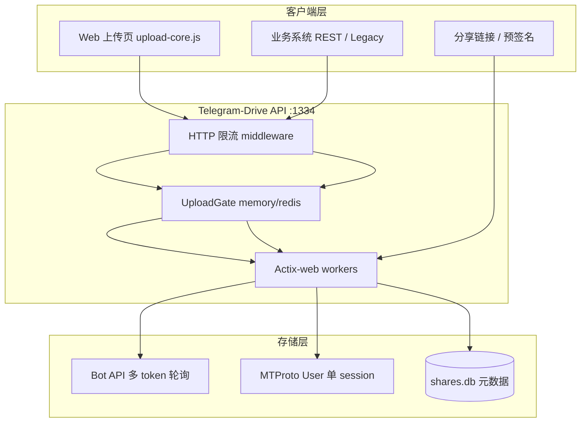

# Telegram Drive — 生产部署与 500 并发指南

面向 **7×24 服务器部署**、**高并发上传** 与 **降级闭环** 的落地手册。  
对标参考项目：tg-disk（轻量分片）、tgDrive（Semaphore+WebSocket）、Pentaract（多 Bot 调度）、K-Vault（健康检查+回归脚本）。

---

## 1. 架构闭环（你已有 vs 需补齐）



| 环节 | 现状 | 参考项目借鉴 |
|------|------|-------------|
| 分片上传 | `/upload_chunk` + merge + SHA256 | tg-disk 同款协议 |
| 服务端背压 | UploadGate 503 + Retry-After | 优于 tg-disk 仅前端限流 |
| 多 Bot | `TG_BOT_TOKENS` + bot_pool | Pentaract worker 池 |
| 错误分类 | `telegram_error.rs` retriable/fatal | K-Vault classifyStorageError |
| Bot 大文件下载 | **新增** HTML/JSON 降级页 | tg-disk 引导页 |
| 健康检查 | `/api/v1/health` + Docker HEALTHCHECK | K-Vault compose depends_on |
| 生产栈 | `docker-compose.prod.yml` + Redis | K-Vault 全栈 compose |

---

## 2. 「500 并发上传」的真实含义

**必须区分两个指标：**

| 指标 | 含义 | 默认配置下的表现 |
|------|------|-----------------|
| **500 并发连接** | 500 个客户端同时 POST `/upload_chunk` | ✅ 可以（Actix + 503 背压，服务不崩溃） |
| **500 路同时打 Telegram** | 500 个分片同时上传到 TG 频道 | ❌ 不可行（Telegram FloodWait + Bot 限流） |

默认 `CHUNK_CONCURRENT=4`、`FILES_CONCURRENT=2`：最多 **4 路分片 + 2 路整文件** 真正占用 Telegram 带宽，其余请求排队或 **503**。

客户端 `deploy/web/assets/upload-core.js` 已对 503 做指数退避（最多 8 次），形成 **「连接可饱和、Telegram 受控、客户端自动重试」** 的闭环。

### 2.1 容量规划公式（经验值）

```
有效分片吞吐 ≈ min(
  CHUNK_CONCURRENT × 副本数,
  Bot数量 × (60000 / BOT_RATE_LIMIT_MS),
  Telegram 账号 FloodWait 上限
)
```

**示例（Bot 模式）：**

- 3 个 Bot，`BOT_RATE_LIMIT_MS=2800` → 约 3 × 21 ≈ **63 分片/分钟** 量级（非 MB/s，需按分片大小换算）
- 要缩短排队时间：增加 Bot 数量 > 单纯提高 `CHUNK_CONCURRENT`

**示例（User 模式）：**

- 单 MTProto session，单文件更大、下载无 20MB 限制
- 适合作为 **大文件主通道**；上传并发仍受 UploadGate 与单 Client Mutex 约束

### 2.2 推荐生产参数（起点）

```env
# .env.prod.example 已包含
CHUNK_CONCURRENT=8
FILES_CONCURRENT=4
CHUNK_SIZE_MB=10
TG_BOT_TOKENS=bot2,bot3,bot4        # 至少 3 个 Bot
BOT_RATE_LIMIT_MS=2800
UPLOAD_QUEUE_BACKEND=redis
REDIS_URL=redis://redis:6379/0
RATE_LIMIT_RPM=600
RATE_LIMIT_API_RPM=1200
METADATA_CACHE_ENABLED=false        # 多副本时必须 false
```

压测：

```powershell
.\tests\integration\stress-upload-slots.ps1 -BaseUrl http://localhost:1334 -Parallel 500
```

期望：**无 OOM/崩溃**，503 比例随槽位饱和而上升。

---

## 3. 部署模式（三档降级）

### 档 A — 单机 7×24（最简单）

```powershell
copy .env.example .env
# 编辑 Bot Token、频道 ID、ACCESS_PWD、API_KEY、DOWNLOAD_SIGNING_SECRET
$env:COMPOSE_FILE = "docker-compose.yml"
docker compose up -d --build
```

- UploadGate：`memory`
- 数据：`./data` 持久化（session、SQLite、transport_mode.json）
- 监控：`GET /metrics` + `/api/v1/health`

### 档 B — 单机 + Redis 门控（为水平扩展做准备）

```powershell
copy .env.prod.example .env
docker compose up -d --build
```

合并 `docker-compose.yml` + `docker-compose.prod.yml`，自动启动 Redis 并切换 `UPLOAD_QUEUE_BACKEND=redis`。

### 档 C — 多 API 副本（高级）

```bash
docker compose -f docker-compose.yml -f docker-compose.prod.yml up -d --scale telegram-drive-api=2
```

**前置条件（易忽略）：**

| 组件 | 多副本要求 |
|------|-----------|
| UploadGate | ✅ Redis 共享槽位 |
| `./data` / SQLite | ⚠️ **必须共享存储**（NFS/EFS），否则各副本元数据不一致 |
| 上传进度 SSE/WS | ⚠️ 进程内 Hub，多副本不同步（客户端应轮询或粘滞会话） |
| Telegram User session | ⚠️ 单文件 session，多副本争用同一 session 文件有风险 |

**务实建议：** 高并发 Bot 模式优先 **单实例 + 多 Bot**；User 模式作第二通道；多副本仅在共享 `data` 卷成熟后再开。

---

## 4. 传输模式降级链

```
Bot 模式（默认，易部署）
  ↓ 单文件 >20MB 下载失败
  → 分片 re-upload（merge 后按 chunk 下载）  [tg-disk 方案]
  → 或切换 TELEGRAM_TRANSPORT_MODE=user       [grammers 大文件]
  ↓ Bot FloodWait 密集
  → 增加 TG_BOT_TOKENS（bot_pool 轮询）
  → 调大 BOT_RATE_LIMIT_MS（降速换稳定）
  ↓ 仍不足
  → User MTProto 作为主上传通道
  ↓ 未来（未实现）
  → StorageFactory 接入 S3/R2 冷备 [K-Vault 架构]
```

Bot 模式下载超 20MB 时，API 返回：

- 浏览器：`400` + HTML 引导页（含上传页链接）
- `Accept: application/json`：结构化 `{ code: "BOT_DOWNLOAD_SIZE_LIMIT", retriable: false, solutions: [...] }`

---

## 5. 反向代理（Nginx 示例）

大文件上传/下载需关闭缓冲、拉长超时：

```nginx
server {
    listen 443 ssl;
    server_name oss.example.com;

    client_max_body_size 5120m;
    proxy_read_timeout 3600s;
    proxy_send_timeout 3600s;
    proxy_buffering off;

    location / {
        proxy_pass http://127.0.0.1:1334;
        proxy_http_version 1.1;
        proxy_set_header Host $host;
        proxy_set_header X-Real-IP $remote_addr;
        proxy_set_header X-Forwarded-For $proxy_add_x_forwarded_for;
        proxy_set_header X-Forwarded-Proto $scheme;
    }
}
```

健康检查路径：`/api/v1/health`（`ready=false` 表示 Telegram 未就绪，可按需从 LB 摘除）。

---

## 6. 运维检查清单

### 每日

- [ ] `GET /api/v1/health` → `status=ok`，`telegram_connected=true`
- [ ] `upload_queue.chunk_slots_available` 不应长期为 0（`/metrics`）
- [ ] 磁盘：`./data` 与 Docker 日志轮转（prod compose 已设 50m×5）

### 每周

- [ ] 运行存储回归：`.\scripts\storage-regression.ps1`
- [ ] 检查僵死分片：maintenance 任务自动清理（`MAINTENANCE_INTERVAL_SECS`）
- [ ] 轮换 `DOWNLOAD_SIGNING_SECRET` 演练（撤销旧预签名链）

### 发版前

- [ ] `cargo test --features headless-server`
- [ ] `docker compose up -d --build` + healthcheck 通过
- [ ] `stress-upload-slots.ps1 -Parallel 32`（或 500 soak）

---

## 7. 你可能还没考虑到的点

| 点 | 说明 |
|----|------|
| **Telegram 账号风控** | 500 连接 + 高 QPS 可能触发账号/Bot 封禁；需多 Bot、限速、监控 FloodWait |
| **SQLite 单连接** | 高并发下 DB 锁竞争；单实例可接受，多实例需共享卷或换 PostgreSQL（未内置） |
| **Bot 20MB 下载 vs 分片上传** | 上传可无限大，Bot **直链下载**仍限 20MB；必须 merge 分片或 User 模式 |
| **预签名 URL 安全** | 默认禁止裸 `file_id`；`DOWNLOAD_SIGNING_SECRET` ≥32 字符，生产勿用占位符 |
| **多租户** | `tenants.json` 与 API Key 隔离；水平扩展时租户数据也在 SQLite |
| **Session 文件** | `data/telegram.session` 损坏 = 需重新登录；应纳入备份 |
| **CI 无真实 TG** | 集成测试用 dummy 凭据；上线前必须跑 `storage-regression` 打真实频道 |
| **Windows vs Linux 生产** | Docker 生产建议 Linux；Windows 开发可用 `dev.bat` |
| **镜像体积** | runtime 阶段已移除 GTK/WebKit（headless 专用，约省 200MB） |
| **503 不是错误** | 高并发下 503 是背压设计；客户端必须实现 Retry-After |
| **元数据缓存** | 多副本 `METADATA_CACHE_ENABLED=true` 会导致列表不一致 |
| **WebDAV / ShareX** | 企业接入走 WebDAV + API Key；与浏览器上传共用 UploadGate |
| **合规** | 存储在 Telegram 频道 = 数据经过 TG 服务器；敏感数据需自评合规性 |

---

## 8. 与参考项目的定位总结

| 项目 | 适合场景 | Telegram-Drive 取舍 |
|------|----------|---------------------|
| tg-disk | 个人/小团队、极小镜像 | 吸收分片协议 + 20MB 降级页 |
| tgDrive | Java 企业、WebSocket 进度 | 吸收 Semaphore 思想 → UploadGate |
| Pentaract | 多用户 + 多 Bot Worker | 吸收 bot_pool；未引入 PostgreSQL 复杂度 |
| K-Vault | 多存储后端 | 保留 TG 专注；StorageFactory 作未来扩展 |
| tgNetDisc | 极简图床 | 不照搬无限重试 |

**Telegram-Drive 定位：** 独立可部署的 **Telegram 无限容量 OSS 网关** — 桌面（Tauri）+ 无头 API 双模式，企业特性（租户、预签名、WebDAV、Prometheus）齐全，Bot 开箱即用、User 模式可扩容。

---

## 9. 快速命令索引

```powershell
# 生产启动
copy .env.prod.example .env
docker compose up -d --build

# 健康
curl http://localhost:1334/api/v1/health

# 存储回归
.\scripts\storage-regression.ps1 -BaseUrl http://localhost:1334

# 并发压测
.\tests\integration\stress-upload-slots.ps1 -Parallel 500

# 指标
curl http://localhost:1334/metrics
```

更多 API 示例见 [README-DOCKER.md](../README-DOCKER.md)。
